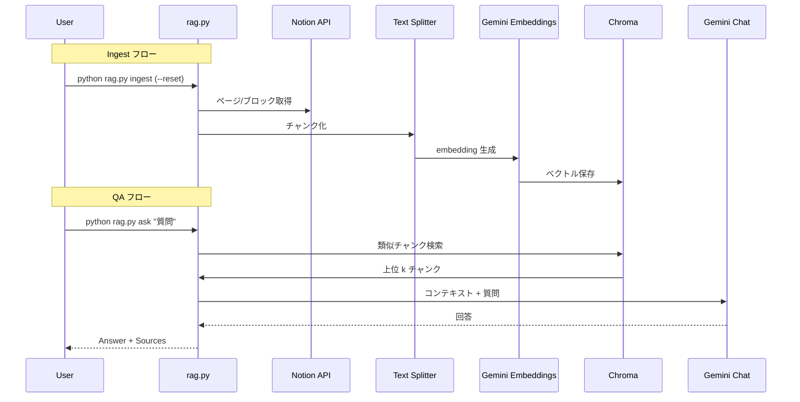

# Gemini × Notion RAG 共有メモ

社内エンジニアに本 PoC の概要を共有するためのドキュメントです。Notion に貼り付けて利用してください。

---

## 1. 業務適用イメージ
- **情報源が Notion ページ単位で整理されている場合に即投入可能**  
例: 「営業 QA 集」「プロジェクト要件まとめ」「社内ナレッジページ」など。ページ内容をチャンク分割 → Embedding → 検索 → 回答生成までを `rag.[...]`
- **想定ユースケース**
  - 少人数チームでの FAQ ボット、問い合わせ対応の一次回答
  - プロジェクト固有の要件書から最新情報を引き出すリサーチ補助
  - 朝会ログなどのまとめページから「昨日の決定事項」を引っ張る用途
- **制約/留意点**
  - Embedding/LLM 呼び出し分の Gemini API コストが発生。Embedding クォータ 0 のプロジェクトでは動作しない。
  - Notion ページ単位の取り込みに限定（データベース全件を一括取得する実装は別途必要）。
  - 取り込み/回答ともに CLI からの実行を前提（Web UI なし）。

## 2. システム構成
```mermaid
flowchart TB
  A["Notion API"\n"(pages.retrieve / blocks.children.list)"]
  B["Python CLI\nrag.py ingest"]
  C["Text Splitter\nRecursiveCharacterTextSplitter"]
  D["Embeddings\nGoogleGenerativeAIEmbeddings\nmodels/embedding-001"]
  E["Chroma Vector Store\ndata/chroma"]
  F["Retriever\nChroma.as_retriever"]
  G["Gemini Chat\nChatGoogleGenerativeAI\nmodels/..."]
  H["Answer Output"]

  A --> B --> C --> D --> E
  B -.->|ask| F
  F --> G --> H
```

- **主要ライブラリ**
  - `notion-client`: ページメタデータ＋ブロック内容を取得
  - `langchain-text-splitters`: 1000 文字／オーバーラップ 200 でチャンク化
  - `langchain_google_genai`: Embedding & Chat モデル呼び出し
  - `langchain_community.vectorstores.Chroma`: ベクトルストア永続化
- **ファイル構成のポイント**
  - `rag.py`: CLI。`ingest` と `ask` のサブコマンドを持ち、`.env` で API キー等を読み込む。
  - `requirements.txt`: LangChain + Notion + Chroma + dotenv など最小依存。
  - `.env`: `NOTION_API_KEY`, `NOTION_PAGE_ID`, `GOOGLE_API_KEY`, `GEMINI_CHAT_MODEL` (任意), `CHROMA_PERSIST_DIR` (任意)。

## 3. ワークフロー（処理の流れ）



## 4. Gemini API の特徴 & 連携方法
- **モデル ID の指定方法**  
  - `google-genai` SDK は `models/<model-name>` 形式で指定。デフォルトは `models/gemini-1.5-flash-latest`。  
  - `.env` で bare 名（例: `gemini-1.5-pro`) を記入しても `rag.py` 側で `models/` を付与するため互換性あり。
- **Embedding**
  - `GoogleGenerativeAIEmbeddings(model="models/embedding-001")` を使用。初回インジェストで全チャンクをベクトル化し、Chroma へ永続化。  
  - Embedding のリクエストはクォータ制限が厳しいため、AI Studio で請求設定を済ませ、プロジェクトと API キーが一致していることを確認する必要あり[...] 
- **Chat**
  - `ChatGoogleGenerativeAI` を使用。Retriever から得たコンテキストをプロンプトに埋め込み、「Notion 情報のみで回答」「不明なら不明と答える」などのガ�[...] 
  - モデル差し替えは `GEMINI_CHAT_MODEL` 環境変数で対応。

## 4. Notion 連携のポイント
- **ページ ID の取得**
  - ブラウザ URL の末尾にある 32 桁 (ハイフン有り/無し) を UUID 形式に整え、`.env` の `NOTION_PAGE_ID` に設定。
- **権限付与**
  - Notion で対象ページを開き、「共有 / コネクト」から今回作成したインテグレーションを追加。親ページ/テンプレートにも共有が必要な場合あり��[...] 
- **取り込み仕様**
  - `blocks.children.list` で各ブロックの rich_text を抽出。`paragraph`, `heading_x`, `bulleted_list_item`, `to_do` など主要ブロックのみ対象。  
  - ページタイトル＋本文を 1 つの `Document` にまとめ、LangChain の Text Splitter でチャンク化。

## 5. コマンドと運用手順
```bash
# 1. 取り込み（初回 or ページ更新時）
python rag.py ingest --reset    # --reset なしなら既存ベクトルストアを上書きしない

# 2. Q&A
python rag.py ask "職歴を教えて"
```

- `.env` 変更時は再度 `source .venv/bin/activate` またはシェルを再起動しておく。
- `data/chroma` を削除するとベクトルストアが消えるので注意（`--reset` は自動削除）。

## 6. 共有時に伝えたいポイント
- Embedding と Chat の双方で Gemini API を利用するため、クォータ消費は用途によっては高い。利用計画を立てた上で API キーを管理すること。
- Notion 連携は「ページ単位」。データベース全体を扱う場合は別の ingest 実装が必要。
- LLM の出力はコンテキスト依存のため、FAQ など構造化されたページは特に相性が良い。  
- スクリプトは CLI ベースなので、運用フロー（いつ ingest し直すか、どの質問を回すか）を定めた上で共有する。

---

何か追加で調査が必要な項目があれば、このドキュメントに追記していく方針で運用してください。
